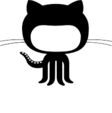

# CIT 281 Project 1

## Learning Objectives

- Basic Unix Shell commands
- Install and Configure Git using the Unix Shell
- Basic Git Commands (add, commit, push, clone)
- Github overview
- Markdown language for README files
- JavaScript ES6+ features
- i learned how to push things from my local repo

[Github](https://github.com/UO-CIT/project-1-giuliop2)
